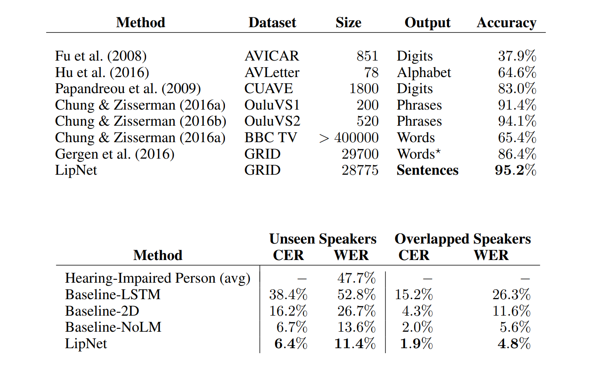

# LipReading
The following is an implementation of the paper [LipNet: End-to-End Sentence-level Lipreading](https://arxiv.org/pdf/1611.01599.pdf) in Tensorflow.

## Introduction
Building a machine learning model that's able to perform lip reading!

## Dataset
This model uses GRID corpus (http://spandh.dcs.shef.ac.uk/gridcorpus/)

## Model

### Prerequisites
1. Install and Import Dependencies
2. Build Data Loading Functions
3. Create Data Pipeline
4. Design the Deep Neural Network
5. Setup Training Options and Train
6. Make a Prediction
7. Test on a Video

## Results
The following table shows the results from the paper:

Here's an inference test:

